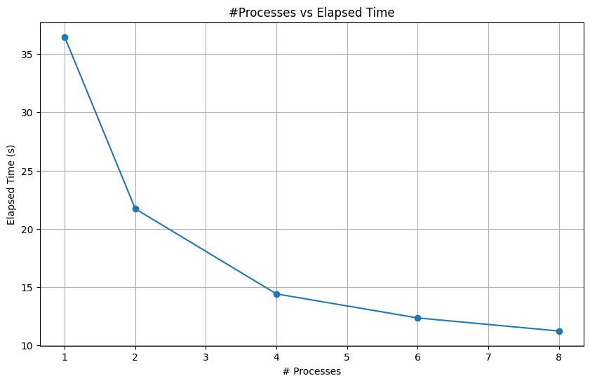

| # Processes | User (s) | System (s) | Elapsed Time (s) | CPU Usage (%) |
|-------------|----------|------------|------------------|---------------|
| 1           | 35.82    | 0.36       | 36.46            | 99            |
| 2           | 39.23    | 0.38       | 21.72            | 182           |
| 4           | 45.80    | 0.75       | 14.42            | 322           |
| 6           | 54.22    | 1.20       | 12.36            | 448           |
| 8           | 62.39    | 1.25       | 11.24            | 565           |

Each row corresponds to a separate run of Game of Life with big field (10000x10000) with a different number of processes.

Here is the plot of it: .

- `# Processes`: refers to the number of separate processes that the Game of Life simulation is distributed across.
- `User (s)`: refers to the total amount of CPU time spent in user-mode within a process. This is the time spent performing program actions, excluding time the CPU spent performing system calls.
- `System (s)`: the amount of CPU time the process spent in the kernel within the operating system, i.e., the amount of time that the CPU was executing system calls.
- `Elapsed Time (s)`: This is the total real time spent. 
- `CPU Usage (%)`: This shows how much of the CPU's capacity was used by the process ((user + system) / elapsed).

Based on the data, we can see that as the number of processes increases, the User & System time increase, while Elasped time decreases. It means that more cores are involved in computations, which we see being reflected in the CPU Usage column. 

An interesting observation here is that in case of single process, CPU Usage is 99%, but as we increase number of processes, we see that each process contributes less than 100% to the CPU Usage. It means that some CPU cores are waiting until some communication happens. 

We also see that the elapsed time does not decrease linearly. For example, we only see a difference of 1 second between 6 processes and 8 processes. It means that a significant time is spent for synchronization (communication) and it also implies that there is a significant overhead to it.

However, the total elapsed time has decreased more than 3 times, which is a very good result.
